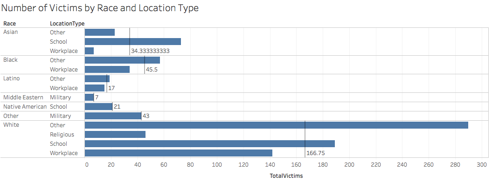

<center></center>

#**Introduction**

For Project 5, we clean two datasets in RStudio with regular expression and loops, using the ***US County Demographics*** and ***Poverty Rate*** datasets that are downloaded from data.world/asheville and data.world/health. Using shiny app from RStudio and Tableau, we visualize the relations between counties in California, race, and poverty.

###The Project Notebook is [here](Notebook.nb.html). 
###GitHub repository is [here](https://github.com/CannataUTDV/s17dvproject6-dvproject-5-chi-rambo-xu-zhang-1).

#**R Configuration**
Below we display our sessionInfo.

```{r sessionInfo}
sessionInfo(package=NULL)
```

#**Dataset**

###**Accessing raw dataset from the _data.world_**

From these urls: https://data.world/health/poverty-rate-california-region, https://data.world/asheville/5y-demographic-data-2013-by-co, we download our raw datasets and access them by queries through _data.world_ server.

###**Download cleaned dataset from _data.world_**

From this url:  https://data.world/andyzhang/s-17-dv-project-6, people are able to access to a private data under the user name _andyzhang_. Corresponding to the dataset description, there are two cleaned files there called ETLLL and ETLPR.

#**Data Cleaning**

```{r}
source("../01 Data/ETL FA&PR.R")
```

###**A Summary of Dataset**

```{r}
print(summary(LL))
```

```{r}
print(summary(PR))
```

This is a summary of all the dimensions and measures of our county demographics and poverty data. A sample of 7 entries are shown for each column.

###**The Dimensions of Dataset**

```{r}
print(head(LL[LLdimensions]))
```

```{r}
print(head(PR[PRdimensions]))
```

Dimensions are typically items that are non-numerical attributes. In this case, our dimensions consist of: **County Name**, **Race** , and **Region**.

###**The Measures of Dataset**

```{r}
print(head(LL[LLmeasures]))
```

```{r}
print(head(PR[PRmeasures]))
```

Measures are typically items that are quantified numerically (i.e. ints or doubles). In this case, our measures consist of: **Latitude**, **Longitude**, **CountyID**, **RaceCode**,**Poverty population**, and **Total population**.

#**Shiny**
###**Shiny Website**
<iframe src="https://andyzihaozhang.shinyapps.io/project6/" style="border: none; width: 900px; height: 900px"></iframe>

This shows an example of how data points can be selected using the Shiny app and then depicted in a new underlying plot. Using SQL and ggplot, we made crosstabs in Shiny that produce the same visualizations as the Tableau visualizations below.

#**Visualization**
Below we display our four visualizations of the dataset.

###**Visualization 1**

<center></center>

The following is a bar chart of certain races in counties versus the poverty rate (as a percentage). The races are African American, AIAN (American Indian and Alaskan Native), Asian, Latino, Multiple, NHOPI (Native Hawaiians and Other Pacific Islanders), “Other”, and White. There races are individually measured for their poverty rate in each county (some race poverty data is not available for certain counties). The poverty rate is a calculated percentage from the total population and the impoverished population. The reference line for each county set represents the window average (or just average for that county). Each bar is also color-coded on a poverty rate gradient to help visually distinguish between different values. From this visualization, we have realized some interesting observations, such as huge differences in poverty rates based on race in places such as Amador or Colusa.

###**Visualization 2**

<center></center>

Poverty Rate by County
X = County, Y= Poverty Rate

This is a bar graph showing the poverty ratio in every county in California. This visualization distinguishes counties with high/low poverty rates from the rest. Fresno appears to have the highest poverty rate while Placer has the lowest. This bar graph is also useful in creating sets separating counties with high poverty rates from others by highlighting across all counties within the desired range of poverty rate.

###**Visualization 3**
<center></center>
<center></center>
<center></center>

These three maps depict concentrations of populations based on race. The first 
map represents counties containing the populations with the highest povety levels.
The second corresponds to the counties with populations with medium poverty levels, and the third represents counties with populations with low levels of poverty. As shown, high poverty levels are distributed down the middle of California, running north to south, and low levels are concentrated in the middle running east to west. Medium poverty levels are distributed throughout, but with more being concentrated in the upper half section of California.

#**Instructions on Creating the Visualizations**
###**Barcharts**
1. To create this visualization, we first created a new field, "Povert Rate" by dividing the "PovertyPop" by "TotalPop". This field was also formatted as a percentage. The barcharts were made by dragging "County" and "Race" to Rows (with "County" before "Race") and "Poverty Rate" to Columns. A new calculated field, "Diff from Avg" was created to show the difference between the poverty rate of each race from the average poverty rate among all races of the respective county. The bars were colored and labeled by this field. Finally, reference lines of the average poverty rate of each county were added and labeled.
<center></center>

###**ID Sets**
2. The bar graph below was made by dragging "County" to Columns and "Poverty Rate" to Rows. The labels on the x-axis were rotated for clearer display of county names. ID sets were made in this graph by highlighting those within the desired poverty ranges. For "high poverty rates"", counties with poverty rates of 20% and above were selected. For medium, 10% to 20% were selected. While the rest belong to the "low poverty rates" set. These sets are used to make pages for the final visualization.
<center></center>

###**ID Sets on a Map**
3. The map below was made with the longitude and latitude data provided by the County Demographic dataset. By dragging the three sets made from the bar graph to Pages, the geographic locations of counties in each of the sets can be identified on the map. To provide more information when the cursor is hovered over the points, TotalPop and PovertyPop were dragged to Detail.
<center></center>