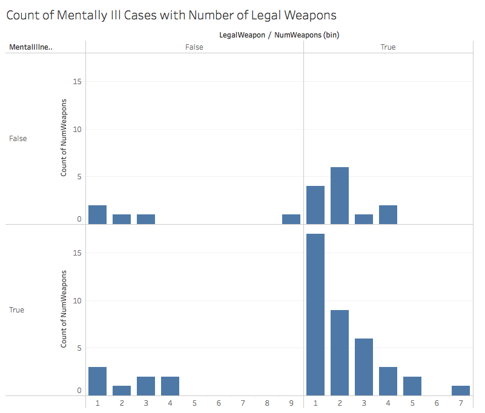

<center></center>

#**Introduction**

For our Final Project, we cleaned three datasets in RStudio with regular expression and loops, using the ***US Mass Shootings***, ***US States*** and ***DHS City Location Example*** datasets that are downloaded from data.world/awram, data.world/markmarkoh and data.world/bryon, respectively. Using shiny app from RStudio and the Tableau software, we visualize the relations between mass shootings in the US, race of the shooters, numbers of fatalities and victims, and the location types. In the Mass Shootings dataset, mass shootings are defined by events with more than four victims, excluding robbery and gang violence incidents, from 1982 to 2015.

#**R Configuration**
Below we display our sessionInfo.

```{r sessionInfo}
sessionInfo(package=NULL)
```

#**Dataset**

###**Accessing raw dataset from the _data.world_**

From these urls: _US Mass Shootings_ https://data.world/awram/us-mass-shootings, _US State Table_ https://data.world/markmarkoh/us-state-table, _DHS City Location Example_ https://data.world/bryon/dhs-city-location-example, we download our raw datasets and access them by queries through _data.world_ server.

###**Download cleaned dataset from _data.world_**

From this url: https://data.world/andyzhang/final-project, invited persons are able to access to a private data under the user name _andyzhang_. Corresponding to the dataset description, there are two cleaned files there called MassShooting, StateAbbrev and LatLong.

#**Data Cleaning**

```{r}
source("../01 Data/ETL.R")
```

###**A Summary of Dataset**

```{r}
print(summary(MassShooting))
```

```{r}
print(summary(StateAbbrev))
```

```{r}
print(summary(LatLong))
```

This is a summary of all the dimensions and measures of our county demographics and poverty data. A sample of 7 entries are shown for each column.

###**The Dimensions of Dataset**

```{r}
print(head(MassShooting[MSdimensions]))
```

```{r}
print(head(StateAbbrev[SAdimensions]))
```

```{r}
print(head(LatLong[LLdimensions]))
```

Dimensions are typically items that are non-numerical attributes. In this case, our dimensions consist of: **Case**, **Gender** , **Race**, **City**, **State**, **Location Type**, **Mental Illness**, **Legal Weapon**, and **Abbreviation**.

###**The Measures of Dataset**

```{r}
print(head(MassShooting[MSmeasures]))
```

```{r}
print(head(LatLong[LLmeasures]))
```

Measures are typically items that are quantified numerically (i.e. ints or doubles). In this case, our measures consist of: **Year**, **Fatalities**, **Wounded**, **Total Victims**,**Number of Weapons**, **Latitude**, and **Longitude**.

#**Shiny**
###**Shiny Website**
<iframe src="https://andyzihaozhang.shinyapps.io/massshooting/" style="border: none; width: 900px; height: 900px"></iframe>

This shows that datasets were accessed and queried using the Shiny app and then tranformed into different interesting visualizations. Using datatable, ggplot, leaflet and other packages, we made boxplots, histograms, scatter plots, crosstabs, and barcharts in Shiny that produce the same visualizations as the Tableau visualizations below.

#**Visualization**
Below we display and explain our visualizations of the dataset.

###**Visualization 1: Boxplot**
The following is a boxplot of total victims on the y-axis and races on the x-axis. The races are categorized by Asian, Black, Latino, Native American, Other (Multiracial), and White. The total victims are identified by a count.
<center></center>

####**Interesting observation(s)**
One interesting observation seen from this visualization is the significantly high number of data points in the White column. Total victims in this column also appear to be higher relative to other races, contrary to some current public assumptions (i.e. "black on black violence", "middle-eastern terrorists, etc.)


###**Visualization 2: Histogram**

The following is a histogram of the number of legal weapons carried (x axis) versus the count of instances a shooting occured with the # of weapons. This histogram is filtered by cases of prior mental illnesses (true) and the legality of the weapons (true).
<center></center>

####**Interesting observation(s)**
One interesting observation from this visualization is the shocking number of people being approved for firearms while having a prior mental illness. This may provide further interpretation on our current gun laws.

###**Visualization 3: Scatterplot**


The following is a scatterplot of the number of fatalities per incident (x axis) versus the number of weapons (y axis, legality does not matter), colored by the type of location the shooting occured (military, other, religious, school, workplace).
<center></center>

####**Interesting observation(s)**
One interesting observation of this visualization is the alarming fact of the data located around the top left corner (high number of weapons, low fatalities). Even though the fatality count was low, further observations could be made on how these data points are mainly school and workplace areas, which brings concern to how these weapons entered these premises (in such quantities).


###**Visualization 4: Crosstabs**
The following is a crosstab of the location of the shooting (x axis) versus the state of the shooting (y axis), categorized by "Fatal Rate 2" colors (Blue/Low = 0-0.5,Green/Medium = 0.5-0.7, Red/High = >0.7). The "Fatal Rate 2" categories are further defined by "Fatal rate", which is essentially SUM([Fatalities])/SUM([TotalVictims]).
<center></center>

####**Interesting observation(s)**
One interesting observation of this visualization is the fact that a relatively large amount of shootings (of all categories) are occuring in the workplace and the school areas. This could lead to the observation that more people "snap" in these areas(which suggests for more mental health counseling services), or possibly these places are "popular" areas to start violent incidents (which suggests for more security).

###**Visualization 5: Barcharts**
The following is barcharts of number of victims by race and location type (categorized under race). Average lines for each race are present to compare each location type to the average within each window and also to compare the averages among races.
<center></center>

####**Interesting observation(s)**
One interesting observation is how one incident can skew the averages due to low sample size. For example, the Virginia Tech massacre with 56 total victims is primarily responsible for the high average among the Asian group.

###**Visualization 6: Map**
The following is a map of the mass shooting cases that occurred during the years when total fatalities exceeded 35. Only four years met the condition within this timeframe, 1999, 2007, 2009, and 2012. The size of the data points reflect the number of fatalities in each case.
<center></center>

####**Interesting observation(s)**
An interesting observation is how common mass shootings occur in or near densely populated areas, when comparing the visualization we created to a chloropleth map of population density above.

#**Instructions on Creating the Visualizations on Tableau**
###**Boxplot**
To create this visualization, we dragged *Race* to Columns and *TotalVictims* to Rows. If *sum(TotalVictims)* is in Rows, turn off Aggregate Measures by clicking on Analysis and uncheck Aggregate Measures.

<center></center>

###**Histogram**
The histogram below was created by first generating bins by right-clicking *NumWeapons* -> Create -> Bins. Set the bin width to 1. Drag the newly created bins to Columns. Drag *NumWeapons* to Rows. Right-click *NumWeapons* -> Measure -> Count. We filtered by dragging *MentalIllness* and *LegalWeapon* to Filters and selecting True for both.
<center></center>

###**Scatterplot**
The scatterplot was made by dragging *Fatalities* to Columns and *NumWeapons* to Rows. *LocationType* is dragged to Color to fill each circle with color of the corresponding location type.
<center></center>

###**Crosstabs**
The crosstabs were made by dragging *LocationType* to Columns and *State* to Rows. *TotalVictims* was dragged to Text. We colored the text with a calculated field, *Fatal Rate*. The image below shows the calculation. 
<center></center>
In order to group the fatal rates into low, medium, and high categories, we created parameters such as the one below. Low ranged from 0 to 0.5. Medium ranged from 0.5 to 0.7. and High ranged from 0.7 to 1.
<center></center>
A new field, *Fatal Rate 2* was created to assign each fatal rate to a qualitative measure rather than quantitative. The calculation is shown below.
<center></center>
*Fatal Rate 2* is dragged to Color. We also filtered out the Other type by dragging *LocationType* to Filters and deselecting Other.
<center></center>

###**Barcharts**
The barcharts were made by dragging *TotalVictims* to Columns, and *Race* and *LocationType* to Rows. Average lines were inserted by clicking on the Analytics Tab and double clicking on Average Line.
<center></center>

###**Map**
This map was made by converting *Latitude* and *Longitude* to geographic types by right-clicking them -> Geographic Role -> Latitude (Longitude), then dragging them to Rows and Columns, respectively. We filtered out years when the number of fatalities totaled less than 35, by dragging Year to Filters and selecting 1999, 2007, 2009, and 2012. To add information to the data points, we dragged *City*, *State*, and *Case* to Detail. We varied the sizes of each point by dragging *Fatalities* to Size.
<center></center>